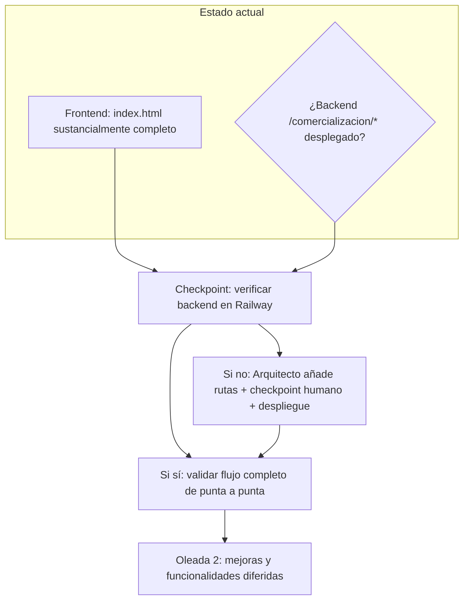

# Pipeline por Oleadas: Comercialización de Café

## Estado Actual (al redactar estos specs)

El `index.html` tiene la aplicación frontend **sustancialmente completa**: login, tabs del caficultor (Ventas, Clientes, Mis datos, Resumen, Parámetros), panel del formador y generación de Word en cliente. Lo que falta confirmar es si los endpoints del backend (`/api/comercializacion/*`) están ya desplegados en Railway o si están pendientes.

La app incluye una salvaguarda: si la ruta del backend no existe o devuelve una respuesta no-JSON, muestra al usuario un mensaje explicativo en lugar de un error técnico. Esto hace que el frontend sea publicable antes de que el backend esté listo, con degradación controlada.

## Visión General del Pipeline



## Oleada 0: Verificación del estado actual (inmediata)

**Objetivo**: confirmar si el backend ya tiene las rutas de comercialización desplegadas o no.

**Acción**: probar `GET https://doc-comite-finanzas-production.up.railway.app/api/comercializacion/listas-ref` con un código válido (ej. `SA-01`). Si responde con JSON → backend listo; si responde con HTML/404 → pendiente de despliegue (Oleada 1 del Arquitecto).

## Oleada 1 del Arquitecto (solo si el backend no está desplegado)

| Tarea | Output | Verificación |
|-------|--------|----------------|
| Añadir las 15 rutas de `/api/comercializacion/*` en `finanzas-cafeteros/app.js` | Rutas funcionando localmente | `node app.js` local: curl/fetch a rutas nuevas y viejas |
| Definir defaults de parámetros para Huila (rendimientos, costes por etapa) | Parámetros coherentes con Costos_Cafe_Huila_Cenicafe_FNC.xlsx | Revisión manual de los valores |

- **Checkpoint humano obligatorio**: el usuario revisa el diff de `app.js` (solo adiciones) antes de desplegar.
- **Despliegue**: `git push` a Railway solo con aprobación explícita del usuario.

**Prompt para el lead**:
```
Revisa el diff de finanzas-cafeteros/app.js producido por el Arquitecto.
Confirma:
1. Solo hay adiciones — ninguna ruta, función o variable existente ha sido modificada o eliminada.
2. Los defaults de parámetros (rendimientos, costes) son razonables para Huila.
3. Las rutas nuevas siguen el mismo patrón de auth que las existentes.

Si todo es correcto, aprueba el despliegue a Railway. Si no, devuelve el diff al Arquitecto
con los cambios específicos que necesita hacer antes de desplegar.
```

## Oleada 2: Validación de punta a punta (tras despliegue del backend)

| Acción | Criterio |
|--------|----------|
| Login con código SA-01 (o código de prueba) | Accede como caficultor; menú con 5 tabs visible |
| Añadir un cliente | Aparece en el listado de Clientes |
| Registrar una venta | Aparece en Historial con márgenes calculados |
| Ver Resumen | KPIs correctos; descarga Excel y Word funcionan |
| Ajustar Parámetros | Se guardan y afectan el cálculo de márgenes en ventas nuevas |
| Login con FORM-SA | Panel del formador visible con consolidado de la comunidad |
| Descarga Excel del formador | Archivo descargado compatible con Operativo_Cafeteros |

## Oleadas Futuras (funcionalidades diferidas de specs/02_producto.md)

Las siguientes funcionalidades están identificadas pero no priorizadas para el MVP:

| Funcionalidad | Complejidad | Dependencia |
|---------------|-------------|-------------|
| Cruce con datos de producción de `finanzas-cafeteros` (rentabilidad real por ciclo) | Media | Requiere que `finanzas-cafeteros` exponga un endpoint de costos de producción por código y período |
| Comparación entre canales de venta (simulación "¿qué habría ganado en E5?") | Baja-Media | Solo frontend: recalcular con los parámetros actuales |
| Histórico de precios por cliente y por etapa (visualización de tendencias) | Media | Solo frontend: agrupar ventas por cliente/etapa/período |
| Integración con `plan-mejora-calidad-cafe` para cruzar acciones de mejora con precios obtenidos | Alta | Requiere coordinación con el equipo del backend para exponer datos de plan |
| Notificaciones de precios de referencia FNC/mercado | Alta | Requiere fuente de datos externa (API pública de precios o entrada manual por formador) |

## Dependencias Críticas

| Tarea | Bloqueada por | Bloquea a |
|-------|-----------------|--------------|
| Uso real por caficultores | Backend `/api/comercializacion/*` desplegado en Railway | Nada más |
| Oleadas futuras de funcionalidades | Aprobación del lead tras validación de punta a punta | Nada (el MVP ya es útil sin ellas) |

## Gestión de Errores

- **Backend no disponible**: el frontend muestra mensaje explicativo (no pantalla en blanco); el usuario sabe qué pedir.
- **Ruta existente rota tras añadir rutas nuevas**: el diff del Arquitecto debe limitarse a adiciones; el checkpoint humano es la defensa antes de desplegar. Si se rompe algo en producción, el rollback es un `git revert` en `finanzas-cafeteros`.
- **Frontend y backend no coinciden en la forma del JSON**: se resuelve leyendo `specs/02_producto.md` y `specs/04_arquitectura.md` como fuente de verdad; si hace falta cambiarlas, se actualiza el spec primero.
